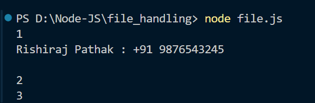
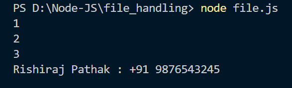

<h1 align="center">Node JS Architecture</h1>

## Synchronous... Blocking Operations

console.log("1");

const res = **fs.readFileSync("./contacts.txt", "utf-8");**

console.log(res);

console.log("2");

console.log("3");

### Output:

## Asynchrounous... Non - Blocking Operations

console.log("1");

**fs.readFile("./contacts.txt", "utf-8", (err, result) => {**

console.log(result);

});

console.log("2");

console.log("3");

### Output:

